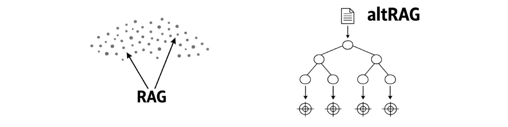
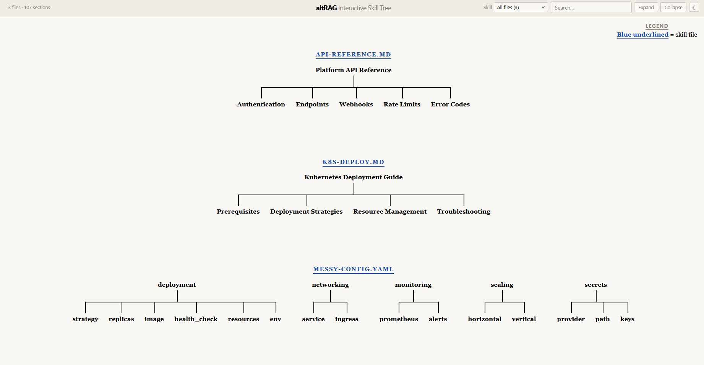

<p align="center"></p>

<h1 align="center">altRAG</h1>
<p align="center"><strong>Pointer-based skill retrieval for LLM agents.</strong><br>Don't use vector DB RAG for everything, use altRAG. We use pointers instead of embeddings</p>

<p align="center">
  <a href="https://pypi.org/project/altrag/"></a>
  <a href="https://github.com/antiresonant/altRAG/blob/main/LICENSE"></a>
  
  
</p>

<p align="center">
  <code>pip install altrag</code>
</p>

---

RAG embeds your docs into vectors, does fuzzy similarity search, and returns chunks that may or may not be what you need. It costs tokens, adds latency, requires a vector DB, and you can't debug why it retrieved what it did.

**altRAG builds a deterministic pointer table.** Every heading in your skill files gets mapped to its exact line number and byte offset. The agent reads the lightweight skeleton during planning (~100 tokens), then reads *only the exact section it needs*. No embeddings. No vector DB. No similarity thresholds. Surgical, deterministic, debuggable.

## Quick start

```bash
pip install altrag
altrag setup
```

That's it. Two commands. `altrag setup`:
1. Finds your skill files (`docs/`, `skills/`, `knowledge/`, or any `.md`/`.yaml`)
2. Scans them into a pointer skeleton (`.skt`)
3. Generates an interactive tree viewer (`HUMAN.html`)
4. Adds the retrieval directive to your agent's config file
5. Installs a git pre-commit hook to keep the skeleton fresh
6. Updates `.gitignore`

## How it works

```
Your docs:                          The skeleton (.skt):

docs/                               @ docs/k8s-deploy.md
  k8s-deploy.md    (195 lines)      1  0     4662  1   195  Kubernetes Deployment Guide
  api-reference.md (200 lines)      2  1163  1565  42  70   Deployment Strategies
                                    3  2110  613   82  28   Canary Deployment
                                    ...
```

Agent needs canary deployment info? Reads the skeleton, finds `Canary Deployment` at **line 82, 28 lines**, reads exactly that. Not the full 195-line file. Not 5 fuzzy chunks. 28 lines.

### RAG vs altRAG

| | RAG | altRAG |
|---|---|---|
| **Setup** | Vector DB + embedding model + chunking config | `pip install altrag` |
| **Indexing** | Embed all docs, store vectors, tune chunk size | `altrag scan docs/` |
| **Query** | Similarity search, top-k, hope for relevance | Read skeleton, follow pointer |
| **Retrieved context** | 2,000 - 10,000 tokens of maybe-relevant chunks | 100 token skeleton + exact section |
| **Determinism** | Probabilistic | Deterministic |
| **Debuggability** | "Why did it retrieve that?" | Open `HUMAN.html`, see the tree |
| **Dependencies** | Vector DB, embedding model, SDK | None |

## Works with every agent

`altrag setup` auto-detects and configures whichever agent you use:

| Agent | Config |
|---|---|
| Claude Code | `CLAUDE.md` |
| Cursor | `.cursorrules` |
| Windsurf | `.windsurfrules` |
| Cline | `.clinerules` |
| GitHub Copilot | `.github/copilot-instructions.md` |
| OpenAI Codex | `codex.md` / `AGENTS.md` |
| Replit Agent | `replit.md` |

No vendor lock-in. The `.skt` format is a plain TSV. Any agent that can read files can use it.

## Commands

```bash
altrag setup                    # does everything — scan, configure, hook
altrag scan <path> -o out.skt   # scan and output skeleton
altrag tree <path>              # open interactive tree viewer
altrag init [dir]               # scaffold a skills directory
```

## Auto-update

The skeleton stays fresh through two mechanisms:

1. **Agent directive** — the config tells the agent to re-scan after modifying skill files
2. **Git hook** — `altrag setup` installs a pre-commit hook that automatically re-scans when skill files change

## Interactive tree viewer

`altrag tree` generates a self-contained HTML file showing your skill architecture as a vertical tree diagram. Click to expand/collapse. Search. Filter by file. Dark/light theme. No server needed — just a local HTML file.

<p align="center"></p>

## Architecture

```
skill files (.md, .yaml)
        |
   altrag scan          <- extracts heading structure with byte/line pointers
        |
  pointer skeleton (.skt)   <- compact TSV, ~100 tokens for a full skill repo
        |
   LLM agent            <- reads skeleton during planning
        |                   reads exact sections during execution
   surgical retrieval    <- 28 lines instead of 5000
```

## License

MIT
